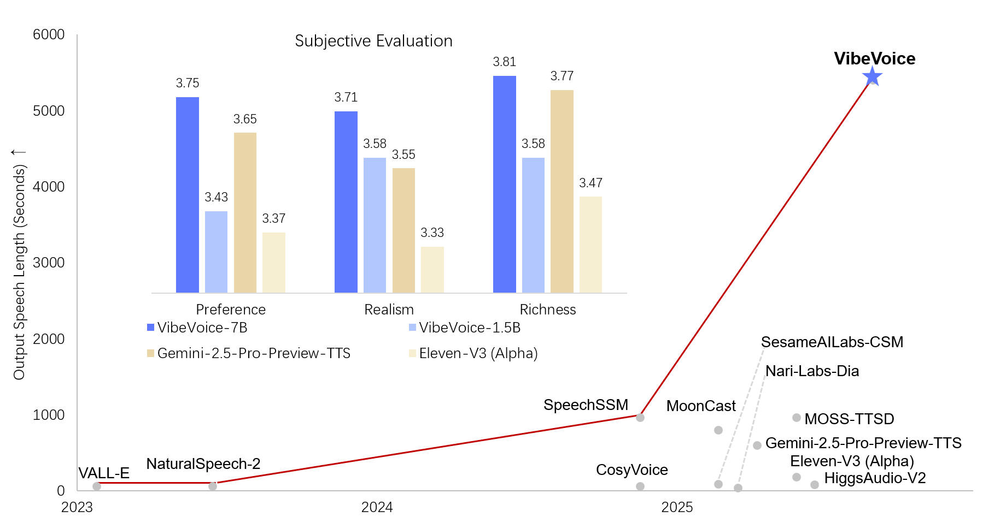

# VibeVoice-TTS

**VibeVoice-TTS** is a **long-form**, **multi-speaker** text-to-speech model designed to generate **expressive conversational audio** such as podcasts from text. It can synthesize speech up to **90 minutes** long with up to **4 distinct speakers**, surpassing the typical 1–2 speaker limits of many prior models.

**Model:** [VibeVoice-1.5B](https://huggingface.co/microsoft/VibeVoice-1.5B) 
**Report:** [Technical Report](https://arxiv.org/pdf/2508.19205) 

| Model | Context Length | Generation Length | Weight |
|-------|----------------|-------------------|--------|
| VibeVoice-1.5B | 64K | ~90 min | [HF link](https://huggingface.co/microsoft/VibeVoice-1.5B) |
| VibeVoice-Large | 32K | ~45 min | Disabled |

## 🔥 Key Features

- **⏱️ 90-minute Long-form Generation**:
  Synthesizes conversational/single-speaker speech up to **90 minutes** in a single pass, maintaining speaker consistency and semantic coherence throughout.

- **👥 Multi-speaker Support**:
  Supports up to **4 distinct speakers** in a single conversation, with natural turn-taking and speaker consistency across long dialogues.

- **🎭 Expressive Speech**:
  Generates expressive, natural-sounding speech that captures conversational dynamics and emotional nuances.

- **🌐 Multi-lingual Support**:
  Supports English, Chinese and other languages.

## 🏗️ Model Architecture

VibeVoice-TTS employs a [next-token diffusion](https://arxiv.org/pdf/2508.19205) framework that combines:

- **Large Language Model (LLM)**: Based on Qwen2.5, understands textual context and dialogue flow
- **Continuous Speech Tokenizers**: Acoustic and Semantic tokenizers operating at an ultra-low frame rate of **7.5 Hz**, efficiently preserving audio fidelity while boosting computational efficiency
- **Diffusion Head**: Generates high-fidelity acoustic details through diffusion-based generation

  

## 🎵 Demo Examples

**English**

https://github.com/user-attachments/assets/0967027c-141e-4909-bec8-091558b1b784

**Chinese**

https://github.com/user-attachments/assets/322280b7-3093-4c67-86e3-10be4746c88f

**Cross-Lingual**

https://github.com/user-attachments/assets/838d8ad9-a201-4dde-bb45-8cd3f59ce722

**Spontaneous Singing**

https://github.com/user-attachments/assets/6f27a8a5-0c60-4f57-87f3-7dea2e11c730

**Long Conversation with 4 people**

https://github.com/user-attachments/assets/a357c4b6-9768-495c-a576-1618f6275727

For more examples, see the [Project Page](https://microsoft.github.io/VibeVoice).

## Installation and Usage
Disabled due to widespread misuse.

## Results

The model achieves state-of-the-art performance on long-form multi-speaker speech generation tasks. For detailed evaluation results, please refer to the [paper](https://arxiv.org/pdf/2508.19205).

  

## 🚨 Tips
We observed users may encounter occasional instability when synthesizing Chinese speech. We recommend:

- Using English punctuation even for Chinese text, preferably only commas and periods.
- Using the Large model variant, which is considerably more stable.
- If you found the generated voice speak too fast. Please try to chunk your text with multiple speaker turns with same speaker label.

We'd like to thank [PsiPi](https://huggingface.co/PsiPi) for sharing an interesting way for emotion control. Detials can be found via [discussion12](https://huggingface.co/microsoft/VibeVoice-1.5B/discussions/12).

## FAQ
#### Q1: Is this a pretrained model?
**A:** Yes, it's a pretrained model without any post-training or benchmark-specific optimizations. In a way, this makes VibeVoice very versatile and fun to use.

#### Q2: Randomly trigger Sounds / Music / BGM.
**A:** As you can see from our demo page, the background music or sounds are spontaneous. This means we can't directly control whether they are generated or not. The model is content-aware, and these sounds are triggered based on the input text and the chosen voice prompt.

Here are a few things we've noticed:
*   If the voice prompt you use contains background music, the generated speech is more likely to have it as well. (The Large model is quite stable and effective at this—give it a try on the demo!)
*   If the voice prompt is clean (no BGM), but the input text includes introductory words or phrases like "Welcome to," "Hello," or "However," background music might still appear.
*   Speaker voice related, using "Alice" results in random BGM than others (fixed).
*   In other scenarios, the Large model is more stable and has a lower probability of generating unexpected background music.

In fact, we intentionally decided not to denoise our training data because we think it's an interesting feature for BGM to show up at just the right moment. You can think of it as a little easter egg we left for you.

#### Q3: Text normalization?
**A:** We don't perform any text normalization during training or inference. Our philosophy is that a large language model should be able to handle complex user inputs on its own. However, due to the nature of the training data, you might still run into some corner cases.

#### Q4: Singing Capability.
**A:** Our training data **doesn't contain any music data**. The ability to sing is an emergent capability of the model (which is why it might sound off-key, even on a famous song like 'See You Again'). (The Large model is more likely to exhibit this than the 1.5B).

#### Q5: Some Chinese pronunciation errors.
**A:** The volume of Chinese data in our training set is significantly smaller than the English data. Additionally, certain special characters (e.g., Chinese quotation marks) may occasionally cause pronunciation issues.

#### Q6: Instability of cross-lingual transfer.
**A:** The model does exhibit strong cross-lingual transfer capabilities, including the preservation of accents, but its performance can be unstable. This is an emergent ability of the model that we have not specifically optimized. It's possible that a satisfactory result can be achieved through repeated sampling.

## Risks and Limitations

While efforts have been made to optimize it through various techniques, it may still produce outputs that are unexpected, biased, or inaccurate. VibeVoice inherits any biases, errors, or omissions produced by its base model (specifically, Qwen2.5 1.5b in this release). Potential for Deepfakes and Disinformation: High-quality synthetic speech can be misused to create convincing fake audio content for impersonation, fraud, or spreading disinformation. Users must ensure transcripts are reliable, check content accuracy, and avoid using generated content in misleading ways. Users are expected to use the generated content and to deploy the models in a lawful manner, in full compliance with all applicable laws and regulations in the relevant jurisdictions. It is best practice to disclose the use of AI when sharing AI-generated content.

English and Chinese only: Transcripts in languages other than English or Chinese may result in unexpected audio outputs.

Non-Speech Audio: The model focuses solely on speech synthesis and does not handle background noise, music, or other sound effects.

Overlapping Speech: The current model does not explicitly model or generate overlapping speech segments in conversations.

We do not recommend using VibeVoice in commercial or real-world applications without further testing and development. This model is intended for research and development purposes only. Please use responsibly.
